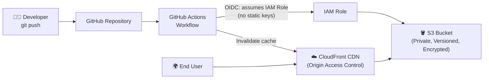

# 🌐 Static Website Hosting on AWS with Terraform & CI/CD

[](https://www.terraform.io/)
[](https://aws.amazon.com/)
[](https://github.com/features/actions)
[](LICENSE)

A fully automated, secure, and scalable static website hosting solution on AWS — provisioned entirely with Terraform and deployed continuously through a GitHub Actions CI/CD pipeline.

> Built and maintained by **Vipul Pal** — [GitHub](https://github.com/thevipul1) · [Portfolio](https://thevipul1.github.io)

---

## 📌 Overview

This project provisions a serverless, CDN-backed static website on AWS using Infrastructure as Code. Every resource — storage, distribution, access control, and deployment roles — is defined in Terraform, making the entire stack reproducible, version-controlled, and disposable.

Instead of manually uploading files or clicking through the AWS console, a push to the `main` branch triggers a GitHub Actions workflow that authenticates to AWS via **OIDC** (no stored long-term credentials) and deploys the latest site content automatically.

---

## 🏗️ Architecture



**Request flow:** End users hit CloudFront edge locations, which fetch content from a private S3 bucket using Origin Access Control (OAC). S3 itself is never exposed to the public internet.

**Deploy flow:** A push to GitHub triggers Actions, which assumes a scoped IAM role via OIDC, syncs files to S3, and invalidates the CloudFront cache.

---

## ✨ Key Features

| Feature | Description |
|---|---|
| **Infrastructure as Code** | Entire stack (S3, CloudFront, IAM, bucket policies) defined and versioned in Terraform |
| **Private S3 + CloudFront OAC** | S3 bucket blocks all public access; only CloudFront can read objects, via Origin Access Control |
| **Global CDN delivery** | CloudFront caches and serves content from edge locations worldwide for low latency |
| **SPA-friendly routing** | Custom error responses (403/404 → `index.html`) support client-side routing for single-page apps |
| **Encryption & versioning** | S3 server-side encryption (SSE) and object versioning enabled for durability and recovery |
| **Keyless CI/CD** | GitHub Actions authenticates to AWS via OIDC — no long-lived access keys stored as secrets |
| **Least-privilege IAM** | The deploy role is scoped to only the permissions needed to sync S3 and invalidate CloudFront |

---

## 🧰 Tech Stack

| Category | Tools / Services |
|---|---|
| **IaC** | Terraform |
| **Cloud Provider** | AWS — S3, CloudFront, IAM, OIDC Identity Provider |
| **CI/CD** | GitHub Actions |
| **Security** | Origin Access Control (OAC), IAM least-privilege roles, OIDC federated auth |
| **Architecture Pattern** | Serverless static hosting, CDN-fronted, SPA-ready |

---

## 📂 Project Structure

```
.
├── terraform/
│   ├── main.tf              # Provider config & module calls
│   ├── s3.tf                # S3 bucket, versioning, encryption, bucket policy
│   ├── cloudfront.tf        # CloudFront distribution + Origin Access Control
│   ├── iam.tf                # OIDC provider + GitHub Actions deploy role
│   ├── variables.tf         # Input variables
│   ├── outputs.tf            # Bucket name, CloudFront domain, distribution ID
│   └── terraform.tfvars      # Environment-specific values (gitignored)
├── .github/
│   └── workflows/
│       └── deploy.yml        # CI/CD pipeline: build → sync to S3 → invalidate cache
├── site/
│   └── ...                   # Static website source files (HTML/CSS/JS)
└── README.md
```

---

## ✅ Prerequisites

- An AWS account with permissions to create S3, CloudFront, and IAM resources
- [Terraform](https://developer.hashicorp.com/terraform/downloads) `>= 1.5`
- AWS CLI configured locally (for initial `terraform apply`)
- A GitHub repository with Actions enabled

---

## 🚀 Getting Started

### 1. Clone the repository
```bash
git clone https://github.com/thevipul1/<repo-name>.git
cd <repo-name>/terraform
```

### 2. Configure variables
Create a `terraform.tfvars` file:
```hcl
aws_region   = "ap-south-1"
bucket_name  = "my-static-site-bucket"
domain_name  = "example.com"   # optional, if using a custom domain
```

### 3. Provision the infrastructure
```bash
terraform init
terraform plan
terraform apply
```

### 4. Configure GitHub OIDC trust
Terraform creates the IAM role and OIDC trust relationship. Note the role ARN from `terraform output` and add it as a repository variable/secret (e.g., `AWS_ROLE_ARN`) used by the GitHub Actions workflow.

### 5. Push to deploy
```bash
git add .
git commit -m "Update site content"
git push origin main
```
GitHub Actions will assume the IAM role via OIDC, sync the `site/` directory to S3, and invalidate the CloudFront cache automatically.

---

## 🔐 Security Highlights

- **S3 Block Public Access** is enabled on the bucket; no object is reachable directly via S3 URLs.
- **CloudFront Origin Access Control (OAC)** is the only entity permitted to read from the bucket, enforced via a tightly scoped bucket policy.
- **OIDC federation** replaces static AWS access keys in GitHub Secrets — GitHub Actions exchanges a short-lived token for temporary AWS credentials at runtime.
- **Least-privilege IAM role** for the CI/CD pipeline limits actions to `s3:PutObject`, `s3:DeleteObject`, `s3:ListBucket`, and `cloudfront:CreateInvalidation` on the specific resources involved.

---

## ⚙️ CI/CD Pipeline

The `.github/workflows/deploy.yml` workflow:

1. Triggers on push to `main`
2. Requests an OIDC token and assumes the AWS IAM role (`aws-actions/configure-aws-credentials`)
3. Syncs the `site/` directory to the S3 bucket (`aws s3 sync`)
4. Creates a CloudFront invalidation so users see the latest content immediately

---

## 📚 What I Learned

- Writing modular, reusable **Terraform** configurations for real AWS infrastructure
- Designing a **secure cloud architecture** with private S3 + CloudFront OAC instead of public buckets
- Automating deployments end-to-end with **GitHub Actions**
- Implementing **OIDC-based IAM role assumption** to eliminate long-lived credentials in CI/CD
- Handling **SPA routing** at the CDN layer using CloudFront custom error responses

---

## 🔭 Future Improvements

- [ ] Add a custom domain with ACM-issued TLS certificate and Route 53 records
- [ ] Add a `terraform destroy` safety check / cost-alarm via AWS Budgets
- [ ] Add a staging environment with a separate Terraform workspace
- [ ] Add automated Lighthouse/performance checks in the CI pipeline

---

## 👤 Author

**Vipul Pal**
Cloud Engineering | System Administration
🔗 [GitHub](https://github.com/thevipul1) · [Portfolio](https://thevipul1.github.io)

---

## 📄 License

This project is licensed under the MIT License — feel free to use it as a reference for your own learning.
